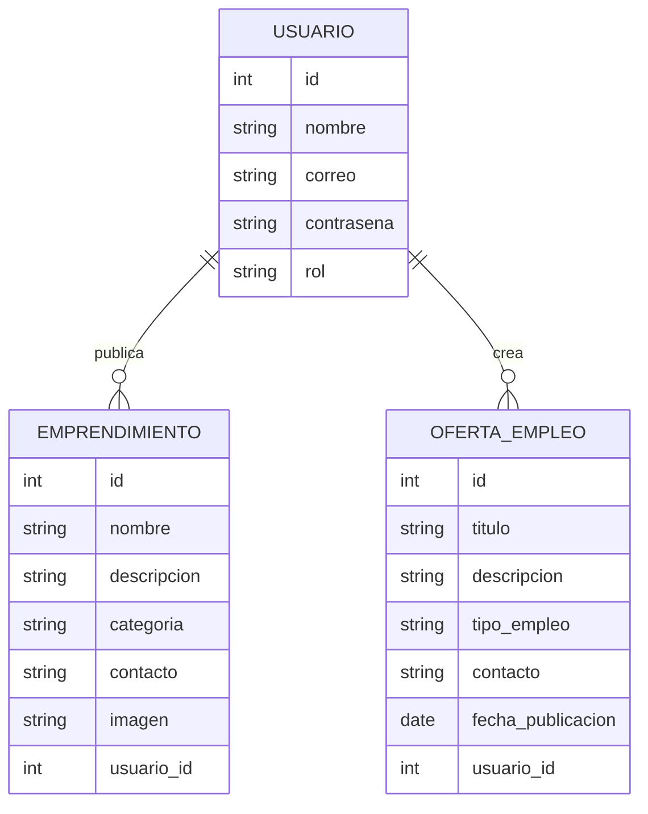

# ARQUITECTURA — Vitrina Doce de Octubre

## Repositorio del Proyecto

Repositorio público GitHub:

https://github.com/samtorres21/arquitectura.md

---

##  Descripción General

**Vitrina Doce de Octubre** es una plataforma web comunitaria diseñada para:

- Visibilizar habilidades y emprendimientos locales.
- Permitir la publicación de servicios.
- Facilitar la búsqueda de ofertas de empleo dentro del barrio Doce de Octubre.

El sistema busca fortalecer la economía local mediante tecnología accesible.

---

##  Arquitectura Seleccionada

Se decidió utilizar una **Arquitectura Monolítica**.

### Definición

Una arquitectura monolítica integra todas las funcionalidades del sistema dentro de una única aplicación desplegable.

---

### Justificación de la decisión

Se eligió arquitectura monolítica porque:

- Reduce la complejidad inicial del desarrollo.
- Facilita el aprendizaje y mantenimiento.
- Permite despliegue sencillo.
- Es ideal para proyectos pequeños y medianos.
- Menor costo de infraestructura.

---

##  Estructura Arquitectónica

arquitectura monolitica

---

##  Modelado del Sistema

El sistema se organiza en capas:

### Capa de Presentación
- Interfaces visuales.
- Formularios.
- Navegación del usuario.

### Capa de Negocio
- Validaciones.
- Gestión de usuarios.
- Publicación de emprendimientos.
- Gestión de empleos.

###  Capa de Datos
- Persistencia de información.
- Consultas a base de datos.

---

## Lógica del Sistema

Flujo básico

- Usuario accede a la plataforma.
- Realiza registro o inicio de sesión.
- Publica emprendimiento u oferta laboral.
- El sistema valida la información.
- Los datos se almacenan en la base de datos.
- Otros usuarios pueden visualizar la información.

##  Modelado de Datos (Diagrama Entidad-Relación)

---
## Stack Tecnologico
### Fronted
- HTML5
- CSS3
- Javascript

### Backend
- Node.js
### Base de datos
-MySQL
-JSON
### Control de Versiones
-Git
-Github

---
## Base JSON del Proyecto
- [Descargar proyecto](./base.zip)
---
# Sprint 3

## Tareas Finalizadas

- https://amigo-team-axypp1be.atlassian.net/jira/software/projects/V1/list/?filter=allissues&jql=project%20%3D%20%22V1%22%20ORDER%20BY%20created%20DESC

---

Se han completado los componentes base de configuración y estructura de la aplicación, cumpliendo con los criterios de aceptación establecidos:

- Configuración del servidor Node.js
  - Inicialización del entorno del servidor.
  - Configuración de dependencias necesarias.
  - Estructuración base del proyecto backend.

- Middleware y validaciones
  - Implementación de middlewares para manejo de solicitudes.
  - Validación de datos de entrada en endpoints.
  - Manejo de errores y respuestas estandarizadas.

- Navegación
  - Implementación de rutas en el frontend.
  - Configuración de navegación entre vistas.
  - Integración de estructura de páginas principales.

  

