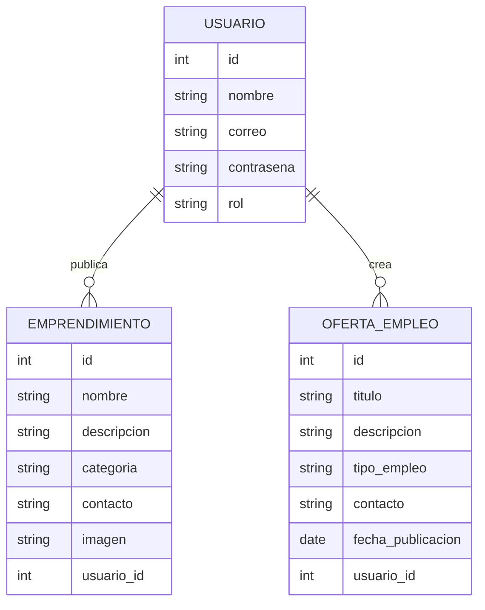

# ARQUITECTURA — Vitrina Doce de Octubre

## Repositorio del Proyecto

Repositorio público GitHub:

https://github.com/samtorres21/arquitectura.md

---

##  Descripción General

**Vitrina Doce de Octubre** es una plataforma web comunitaria diseñada para:

- Visibilizar habilidades y emprendimientos locales.
- Permitir la publicación de servicios.
- Facilitar la búsqueda de ofertas de empleo dentro del barrio Doce de Octubre.

El sistema busca fortalecer la economía local mediante tecnología accesible.

---

##  Arquitectura Seleccionada

Se decidió utilizar una **Arquitectura Monolítica**.

### Definición

Una arquitectura monolítica integra todas las funcionalidades del sistema dentro de una única aplicación desplegable.

---

### Justificación de la decisión

Se eligió arquitectura monolítica porque:

- Reduce la complejidad inicial del desarrollo.
- Facilita el aprendizaje y mantenimiento.
- Permite despliegue sencillo.
- Es ideal para proyectos pequeños y medianos.
- Menor costo de infraestructura.

---

##  Estructura Arquitectónica

arquitectura monolitica

---

##  Modelado del Sistema

El sistema se organiza en capas:

### Capa de Presentación
- Interfaces visuales.
- Formularios.
- Navegación del usuario.

### Capa de Negocio
- Validaciones.
- Gestión de usuarios.
- Publicación de emprendimientos.
- Gestión de empleos.

###  Capa de Datos
- Persistencia de información.
- Consultas a base de datos.

---

## Lógica del Sistema

Flujo básico

- Usuario accede a la plataforma.
- Realiza registro o inicio de sesión.
- Publica emprendimiento u oferta laboral.
- El sistema valida la información.
- Los datos se almacenan en la base de datos.
- Otros usuarios pueden visualizar la información.

##  Modelado de Datos (Diagrama Entidad-Relación)

---
## Stack Tecnologico
### Fronted
- HTML5
- CSS3
- Javascript

### Backend
- Node.js
### Base de datos
-MySQL
-JSON
### Control de Versiones
-Git
-Github
---
## Historias de usuario
- https://amigo-team-ki349xes.atlassian.net/jira/software/projects/HDUVD/boards/34/backlog
---
# Sprint 2

## Tareas Finalizadas
- https://amigo-team-ki349xes.atlassian.net/jira/software/projects/S1/boards/67/backlog
---
Se han completado los módulos principales de gestión de usuarios y comunicación, cumpliendo con los criterios de aceptación establecidos:

 - Registro de usuarios
    * Implementación de la lógica para el alta de nuevos perfiles.
    * Validación de esquemas de datos y persistencia.
 - Inicio de sesión
    * Desarrollo del flujo de autenticación.
    * Gestión de sesiones y seguridad de acceso.
 - Sistema de contacto
    * Creación del módulo para la recepción de mensajes y soporte técnico.

   ---
   # Sprint 3

##  Tareas Finalizadas

- https://amigo-team-axypp1be.atlassian.net/jira/software/projects/V1/list/?filter=allissues&jql=project%20%3D%20%22V1%22%20ORDER%20BY%20created%20DESC

---

Se han completado los módulos relacionados con la gestión de eventos, cumpliendo con los criterios de aceptación establecidos:

- Listar eventos
  - Implementación del endpoint para obtener la lista de eventos.
  - Integración con la base de datos para consulta de eventos.
  - Desarrollo del componente frontend para visualización de eventos.

- Detalle de evento
  - Implementación del endpoint para obtener información detallada de un evento.
  - Desarrollo de la vista de detalle en frontend.
  - Visualización completa de la información del evento.

  ---
  ## Tareas Finalizadas
  - https://amigo-team-axypp1be.atlassian.net/jira/software/projects/V1/list/?filter=allissues&jql=project%20%3D%20%22V1%22%20ORDER%20BY%20created%20DESC

  ---
  # Sprint 4

Se han completado los módulos relacionados con la interacción del usuario y la mejora de la experiencia en la plataforma, cumpliendo con los criterios de aceptación establecidos:

---
## 📌 Comentarios y valoraciones

- Implementación del endpoint para crear comentarios en servicios o eventos.
- Validación de contenido antes de enviar comentarios.
- Integración con la base de datos para almacenamiento de comentarios.
- Desarrollo del componente frontend para visualizar comentarios.
- Sistema de valoración (estrellas o puntuación).

---

## 📌 Notificaciones básicas

- Implementación de lógica para generar notificaciones al usuario.
- Notificación al publicar nuevos eventos o servicios.
- Integración con el frontend para mostrar alertas o mensajes.
- Manejo de estado de notificaciones (leídas/no leídas).

---
## ✅ Resultado del Sprint
Todas las funcionalidades fueron desarrolladas y probadas correctamente, cumpliendo con los criterios de aceptación definidos. El sistema ahora permite mayor interacción del usuario mediante favoritos, comentarios y notificaciones, además de un mejor rendimiento general.

    

  

