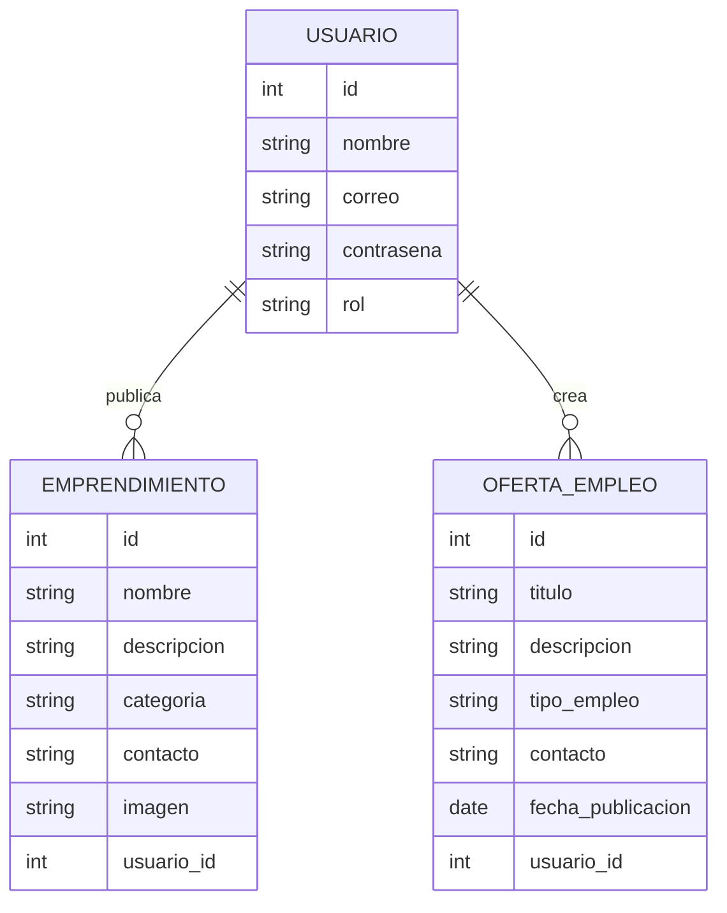

# ARQUITECTURA — Vitrina Doce de Octubre

## Repositorio del Proyecto

Repositorio público GitHub:

https://github.com/samtorres21/arquitectura.md

---

##  Descripción General

**Vitrina Doce de Octubre** es una plataforma web comunitaria diseñada para:

- Visibilizar habilidades y emprendimientos locales.
- Permitir la publicación de servicios.
- Facilitar la búsqueda de ofertas de empleo dentro del barrio Doce de Octubre.

El sistema busca fortalecer la economía local mediante tecnología accesible.

---

##  Arquitectura Seleccionada

Se decidió utilizar una **Arquitectura Monolítica**.

### Definición

Una arquitectura monolítica integra todas las funcionalidades del sistema dentro de una única aplicación desplegable.

---

### Justificación de la decisión

Se eligió arquitectura monolítica porque:

- Reduce la complejidad inicial del desarrollo.
- Facilita el aprendizaje y mantenimiento.
- Permite despliegue sencillo.
- Es ideal para proyectos pequeños y medianos.
- Menor costo de infraestructura.

---

##  Estructura Arquitectónica

arquitectura monolitica

---

##  Modelado del Sistema

El sistema se organiza en capas:

### Capa de Presentación
- Interfaces visuales.
- Formularios.
- Navegación del usuario.

### Capa de Negocio
- Validaciones.
- Gestión de usuarios.
- Publicación de emprendimientos.
- Gestión de empleos.

###  Capa de Datos
- Persistencia de información.
- Consultas a base de datos.

---

## Lógica del Sistema

Flujo básico

- Usuario accede a la plataforma.
- Realiza registro o inicio de sesión.
- Publica emprendimiento u oferta laboral.
- El sistema valida la información.
- Los datos se almacenan en la base de datos.
- Otros usuarios pueden visualizar la información.

##  Modelado de Datos (Diagrama Entidad-Relación)

---
## Stack Tecnologico

### Fronted

- HTML5
- CSS3
- Javascript

### Backend

- Node.js
### Base de datos

-MySQL
-JSON
### Control de Versiones

-Git
-Github
---
---

## Historias de usuario
- https://amigo-team-ki349xes.atlassian.net/jira/software/projects/HDUVD/boards/34/backlog
  
---

# Sprint 2.2

## Validacion del proyecto
- https://docs.google.com/spreadsheets/d/1HRVmu0zwLBOxuMnEl2w-ohy87npM7uIpf1_0t9toiWM/edit
---
# Sprint 3.2

## Tareas Finalizadas

- https://amigo-team-axypp1be.atlassian.net/jira/software/projects/V1/list/?filter=allissues&jql=project%20%3D%20%22V1%22%20ORDER%20BY%20created%20DESC

---

Se han completado los módulos relacionados con la gestión de artistas, cumpliendo con los criterios de aceptación establecidos:

- Listar artistas
  - Implementación del endpoint para obtener la lista de artistas.
  - Integración con la base de datos para consulta de perfiles.
  - Desarrollo del componente frontend para visualización de artistas.

- Crear perfil artístico
  - Desarrollo del formulario para registro de artistas.
  - Validación de campos requeridos.
  - Implementación del endpoint para creación de perfiles.
  - Integración frontend-backend para persistencia de datos.

- Detalle de artista
  - Implementación del endpoint para obtener información detallada de un artista.
  - Desarrollo de la vista de detalle en frontend.
  - Visualización completa de la información del perfil artístico.

  ---
  ## Tareas Finalizadas
  - https://amigo-team-axypp1be.atlassian.net/jira/software/projects/V1/list/?filter=allissues&jql=project%20%3D%20%22V1%22%20ORDER%20BY%20created%20DESC

  ---
  # Sprint 4.2

Se han completado los módulos relacionados con la administración de contenido, cumpliendo con los criterios de aceptación establecidos:

---
##  Eliminación de eventos y servicios

- Implementación del endpoint para eliminar eventos y servicios.
- Validación de permisos antes de eliminar contenido.
- Eliminación lógica o física en la base de datos.
- Confirmación de acción en el frontend.
- Actualización automática de la lista después de eliminar.

---

##  Panel básico de administración

- Desarrollo de una vista para gestión de contenido.
- Visualización de eventos y servicios creados.
- Acceso a opciones de editar y eliminar.
- Integración con backend para operaciones CRUD.
- Interfaz sencilla para administración.

---

## Resultado del Sprint
Se implementaron funcionalidades clave para la gestión y control del contenido dentro de la plataforma, permitiendo una administración más completa.

---
# Sprint 5

## Descripción

En este sprint se finalizaron todas las funcionalidades pendientes del proyecto y se completaron los objetivos establecidos en los sprints anteriores.

El código quedó completamente integrado, probado y listo para su entrega/despliegue. Además, se realizaron ajustes finales, validaciones y optimizaciones para garantizar la estabilidad y el correcto funcionamiento de la aplicación.

## Estado del Proyecto

- ✅ Todos los sprints completados
- ✅ Funcionalidades implementadas
- ✅ Integración final realizada
- ✅ Corrección de errores y optimizaciones
- ✅ Código listo para producción

